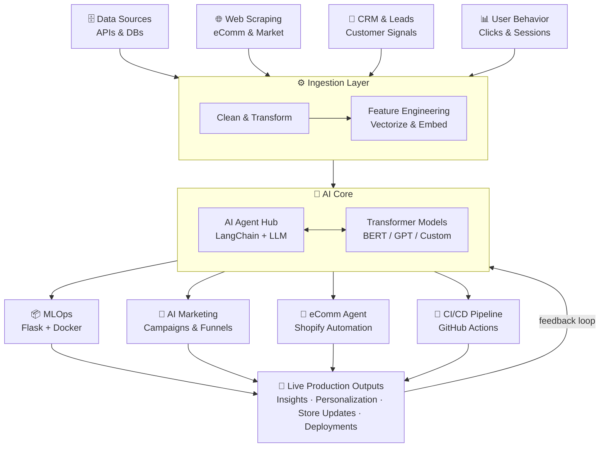

<h1 align="center">
  
</h1>

  
  

---

## 🚀 About Me

- 🎓 Pursuing a **Bachelor's in Computer Science** at **Washington University of Virginia** (VA, USA)
- 🤖 Specializing in **AI Agenting** & **AI Marketing** systems
- 🧠 Strong interest in **MIS & Applied AI**
- 📊 Passionate about building **data-driven systems**
- 🔍 Interested in **model optimization** & real-world ML deployment
- 📈 Currently exploring **MLOps** & scalable ML systems
- 🛒 Background in **eCommerce UX Systems** & **Premium Store Development**

---

## 🌱 Currently Learning

| Area | Focus |
|------|-------|
| 🧠 **Deep Learning** | Architectures — CNNs, RNNs, Attention Mechanisms |
| 🔄 **Transformer Models** | BERT, GPT-style architectures & fine-tuning |
| 🚀 **Model Deployment** | Flask & Docker for production ML pipelines |
| ⚙️ **MLOps** | Scalable, automated ML systems & monitoring |
| 🤖 **AI Agenting** | Autonomous agents, tool-use, multi-agent frameworks |
| 📣 **AI Marketing** | LLM-powered campaigns & data-driven growth systems |

---

## 🛠️ Tech Stack & Tools

**AI / ML**

  
  
  
  
  
  
  
  

**Data & MLOps**

  
  
  
  
  
  

**Web & eCommerce**

  
  
  
  
  
  
  

---

## 📊 GitHub Stats

  
  

  

---

## 🏆 GitHub Trophies

  

---

## 🔄 Automation Workflow Architecture

---

## ⚙️ Automation & Workflow

  
  
  
  
  
  
  
  

| Workflow | Description |
|----------|-------------|
| 🔁 **CI/CD Pipelines** | Automated build, test & deploy with GitHub Actions |
| 🤖 **AI Agent Workflows** | Multi-step autonomous task automation with LangChain |
| 📣 **AI Marketing Automation** | LLM-driven campaign triggers & personalization flows |
| ⚡ **Data Pipelines** | ETL automation with Airflow & Python schedulers |
| 🛒 **eCommerce Automation** | Order, inventory & theme deployment workflows |

---

## 📈 Contribution Activity

  

---

## 💬 Ask Me About

- 🤖 **AI Agenting** — Autonomous agents, LangChain, multi-agent pipelines
- 📣 **AI Marketing** — LLM-driven campaigns & personalization engines
- 🧠 **Machine Learning** — Model building, evaluation & optimization
- 📊 **MIS & Data Systems** — Business intelligence & data-driven decisions
- 🚀 **MLOps & Deployment** — Flask, Docker, scalable ML infrastructure
- 🛒 **eCommerce & Shopify** — UX systems, custom themes, Commerce architecture

---

## 🌐 Portfolio & Links

  
  
  

---

  

